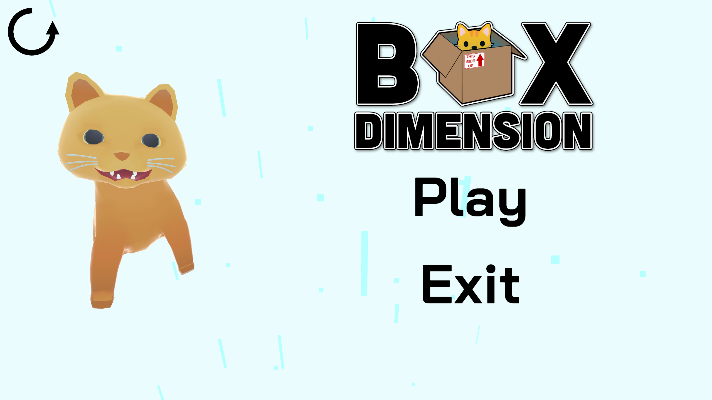
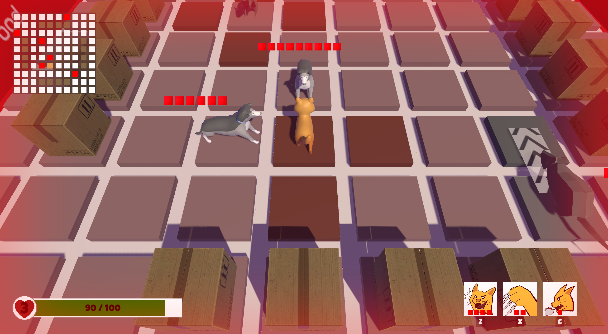
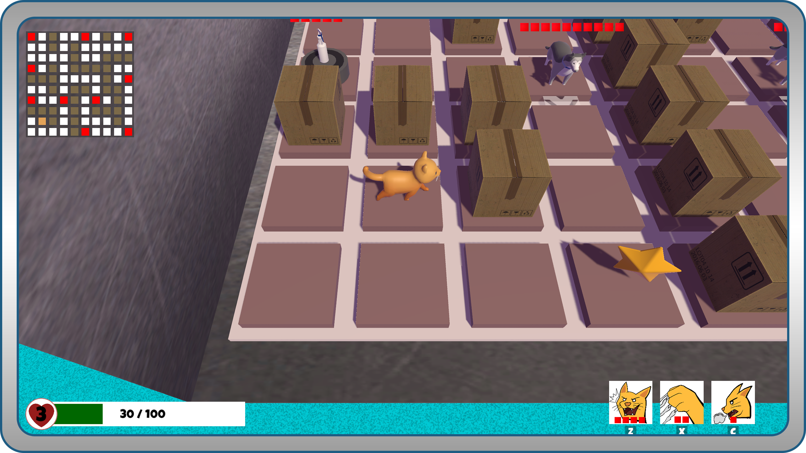

# **The Box Dimension**

## Description:
The Box Dimension is a turn-based action game, developed as the showcase project for EECS 494. Created over the course of six weeks by a talented team, the game features a cat inside a box, attempting to escape while battling various enemies. Below, you’ll find showcase images and a download link.

<iframe width="560" height="315" src="https://www.youtube.com/embed/3QQ4j90dH1U?si=xOavBfi-46ibVQhB" title="YouTube video player" frameborder="0" allow="accelerometer; autoplay; clipboard-write; encrypted-media; gyroscope; picture-in-picture; web-share" referrerpolicy="strict-origin-when-cross-origin" allowfullscreen></iframe> 

<a href="https://avanlian.itch.io/the-box-dimension">
  <button>
    Download
  </button>
</a>

<a href="https://youtu.be/HBWRyPRi3Tk">
  <button>
    Gameplay
  </button>
</a>
 
<a href="./">
  <button>
    Home
  </button>
</a>

## Images

## Technologies Used
- Unity Game Engine
