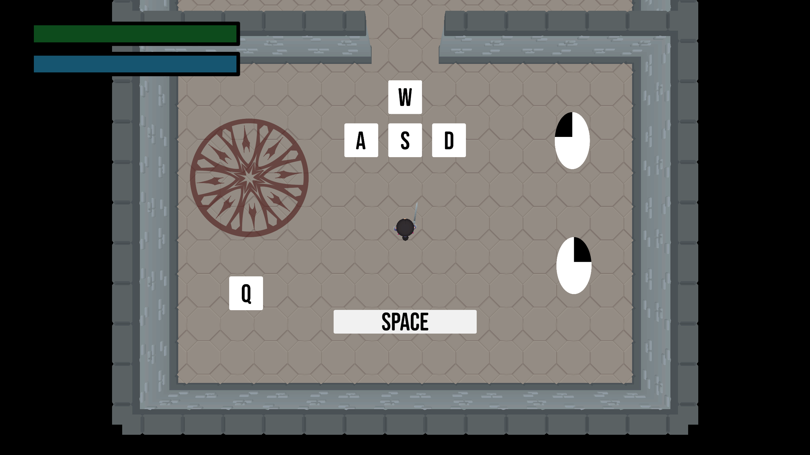
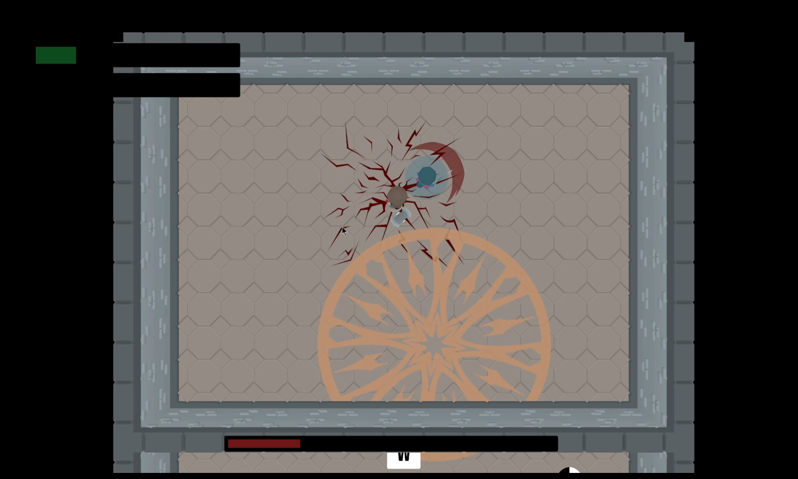
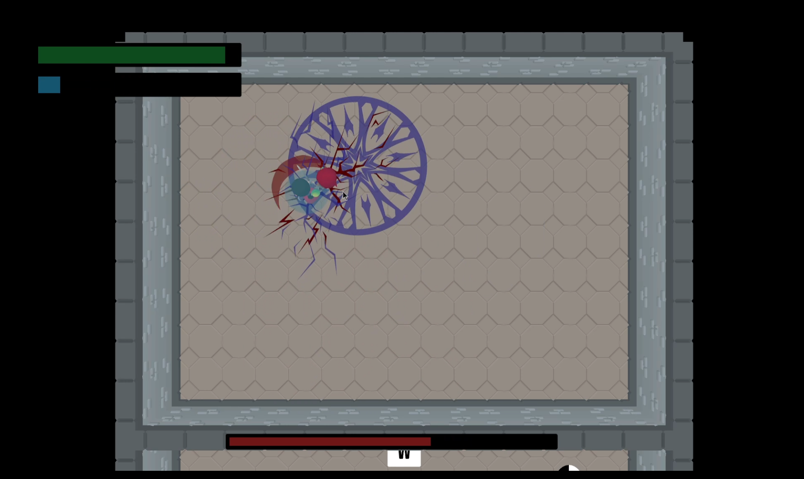
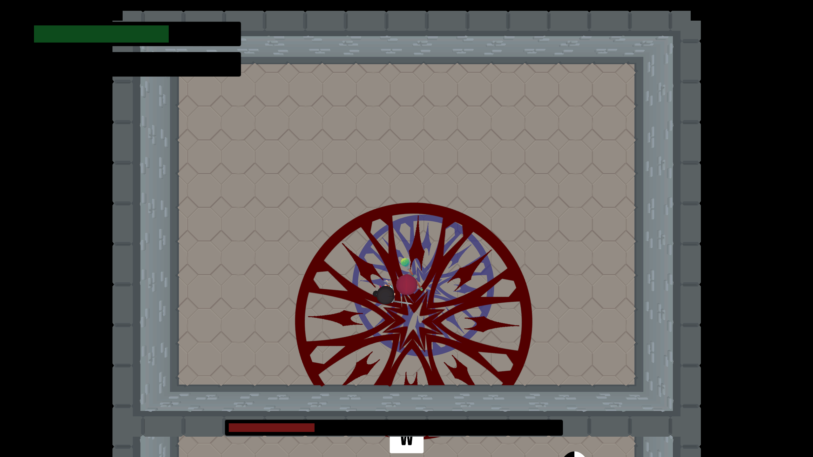

# **Wizard Wars**

## Description:
Wizard Wars is a top-down action fighting game, initially developed as a rapid prototype for EECS 494. Taking inspiration from games such as Hades, and various other titles, Wizard Wars is designed to challenge the player, and provide an exciting experience. This project is close to my heart, and I am actively working on its continuation. I aim to add new features and gameplay mechanics while improving the overall structure of the program. Below, you’ll find showcase images and a download link.

## [Download Here](https://avanlian.itch.io/wizard-wars)

## [Gameplay Footage](https://youtu.be/dOp4nw237zI)

## [Return](./)

## Images

## Technologies Used
- Unity Game Engine
- Photoshop
