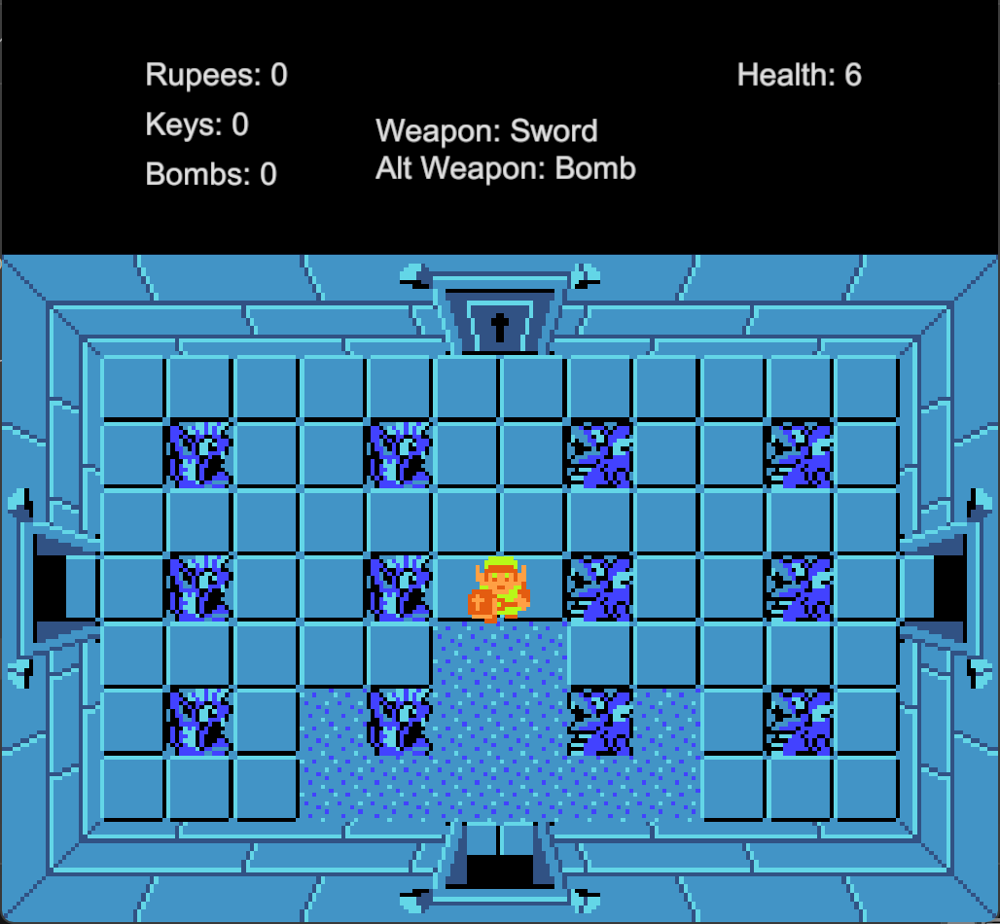
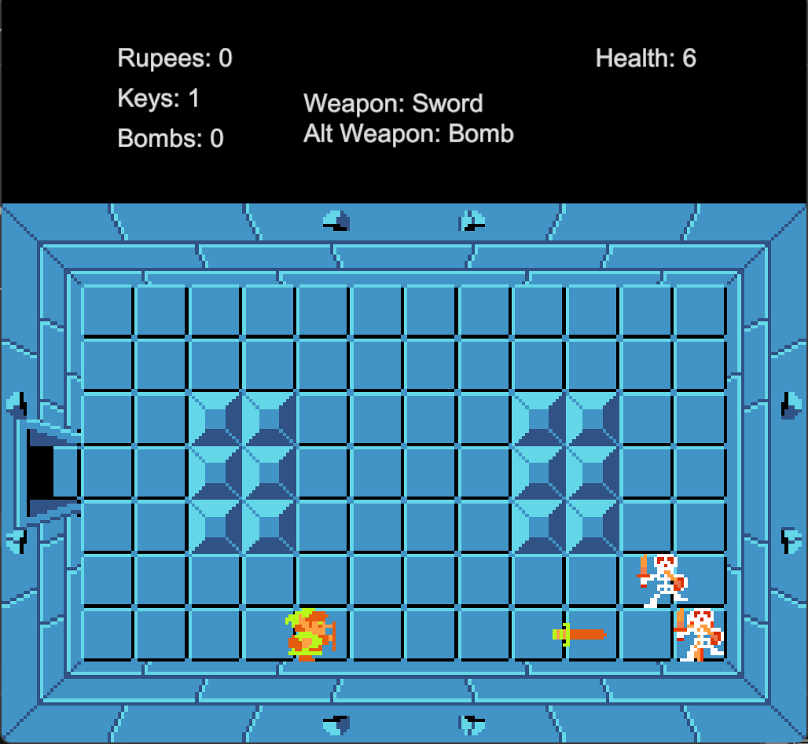
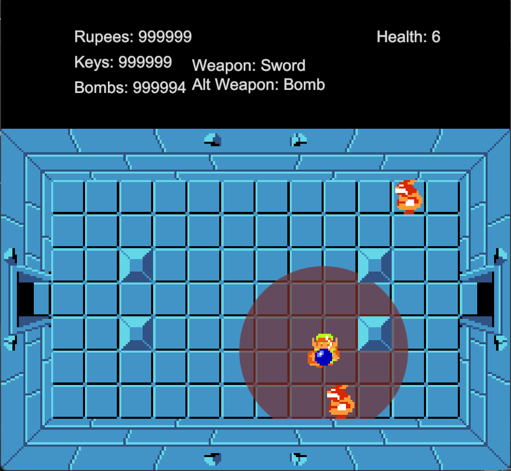
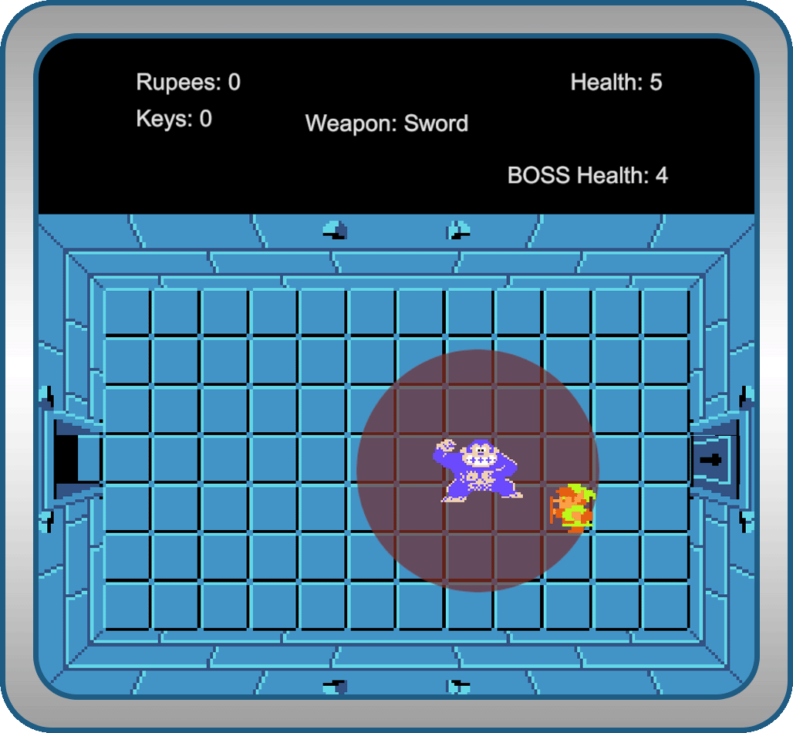
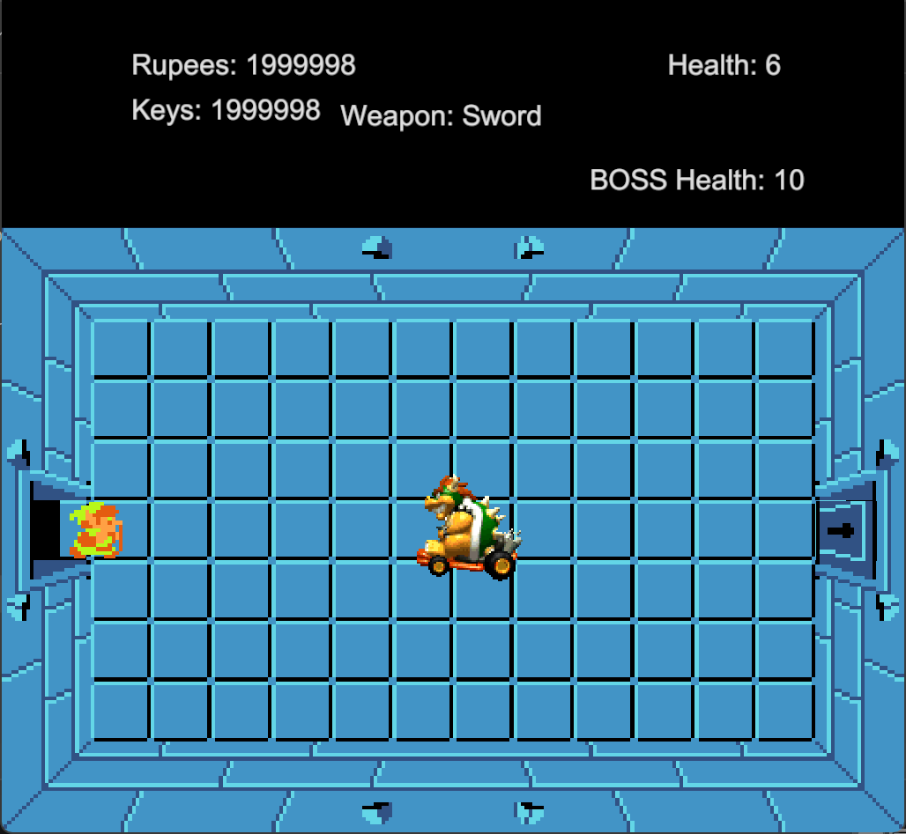

# **The Legend of Zelda - Unity Remaster**

## Description:
The Legend of Zelda project is a "remaster" of the first dungeon from the classic NES game, created in Unity as a learning experience. Developed by a friend and I, this project helped us familiarize ourselves with the Unity engine. Although it only includes the first dungeon and isn’t an exact recreation, we expanded the experience by designing and coding two unique bosses. Below, you’ll find showcase images and a download link.

<a href="https://avanlian.itch.io/wizard-wars">
    
</a>

<a href="./">
    
</a>
 
## Images

## Technologies Used
- Unity Game Engine
